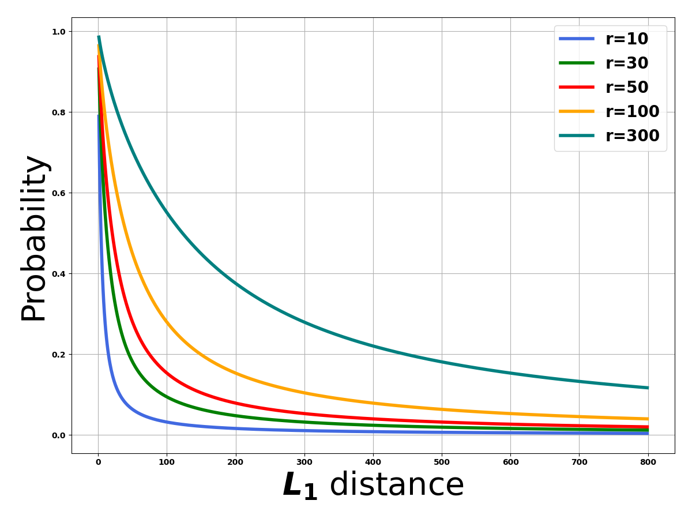
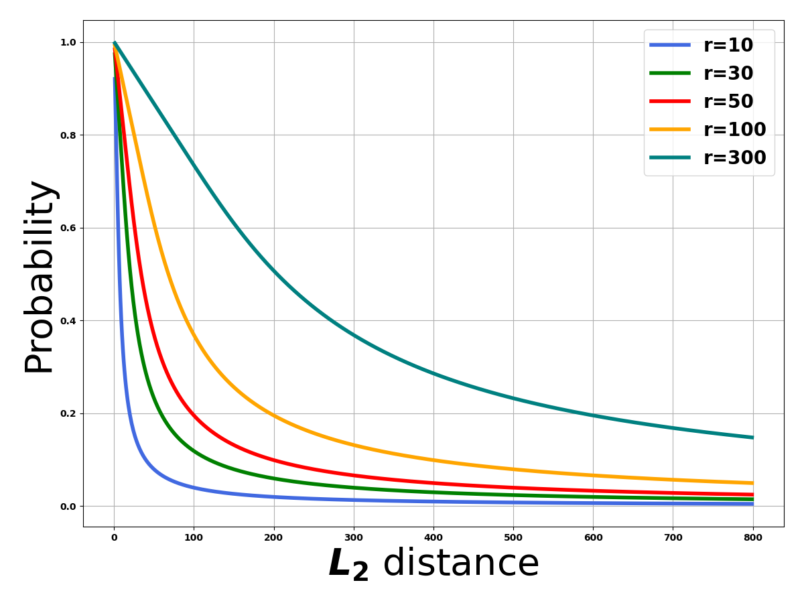

# P-stable-LSH

The package is one implementation of paper Locality-Sensitive Hashing Scheme Based on p-Stable Distributions in SCG’2014. P-stable-lsh a novel Locality-Sensitive Hashing scheme for the Approximate Nearest Neighbor Problem under $L_p$ norm, based on p-stable distributions.

Note: This code is used as the practice of the paper, and there are few optimizations. Sharing is for communication and learning. If it is a high-performance scenario, please optimize as appropriate.

## Installation

```bash
pip install p-stable-lsh-python
```

## Usage

### Example

The following example shows all features of the package, If you want to know the details, please refer to the source code and comments.

```python
import numpy as np
import p_stable_lsh.pstable as psl

dim = 100 # vector dimension
data = [np.random.random(dim) for _ in range(2)] # generate two vectors

r = 50.0 # the parameter $r$ in paper

m1 = psl.pstable(r, dim, metric_dim=1)
m1.lsh(data[0])
m2 = psl.pstable(r, dim, metric_dim=1)
m2.lsh(data[1])
print(m1.md(m2)) # estimate value
print(m1.p(np.average(sum(np.abs(data[0]-data[1]))))) # theoretical(true) value

m1 = psl.pstable(r, dim, metric_dim=2)
m1.lsh(data[0])
m2 = psl.pstable(r, dim, metric_dim=2)
m2.lsh(data[1])
print(m1.md(m2)) # estimate value
print(m1.p(np.sqrt(sum([i**2 for i in data[0]-data[1]])))) # theoretical(true) value
```

### Use case

Define the parameter $r$ and vector dimension for preparing the test data:

```python
import numpy as np
import p_stable_lsh.pstable as psl
r = 50.0 # the parameter $r$ in paper
dim = 100 # vector dimension
data = [np.random.random(dim) for _ in range(3)] # generate two vectors
```

Instantiate `pstable` object with specific dimension space. ($L_1$ for example)

```python
m1 = psl.pstable(r, dim, metric_dim=1)
m2 = psl.pstable(r, dim, metric_dim=1)
```

Hash vectors with p-stable LSH function.

```python
m1.lsh(data[0])
m2.lsh(data[1])
```

Estimate distance between two object.

```python
m1.md(m2) # estimate value
```

Show the ground truth distance probability using integration shown in paper.

```python
l1_distance = np.average(sum(np.abs(data[0]-data[1])))
m1.p(l1_distance)
```

Another way to instantiate `pstable` object with hash values.

```python
m3 = psl.pstable(r, dim, metric_dim=1, hashvalues=m1.hashvalues)
m3.md(m2)
```

Update object hash values with different vector.

```python
m2.lsh(data[2])
m3.md(m2)
```

### Parameters

The parameter $r$ in paper determines the relationship between the distance (in metric space) between vectors and the probability of collision (the `.md` method). The following shows different probability results varied by $r$.

#### L1 metric space

Data points code

```python
import p_stable_lsh.pstable as psl
r_list = [10, 30, 50, 100, 300, ]
result = []
for r in r_list:
    tmp = []
    m = psl.pstable(r, dim, metric_dim=1)
    for i in range(1, 800):
        tmp.append(m.p(i))
    result.append(tmp)
```



#### L2 metric space


